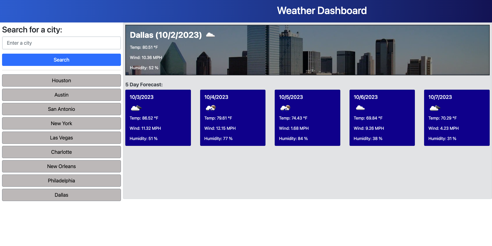

# Weather Dashboard

## Description

This project uses a third-party API to access weather data from openweathermap.org to build an application that shows current weather, along with a five-day forecast for a given city. Using an API key, the data needed for this application is collected by making API requests with specific parameters included within the URL.

- The motivation for this project is to provide users with a tool to facilitate improved travel planning.
- This application was built to provide end users with convenience, options, and weather-based contingencies before and while traveling.
- Users have an alternative source for weather data.
- Lesson: There seems to be information available via APIs than GUIs.

## Table of Contents

- [Usage](#usage)
- [Credits](#credits)
- [License](#license)

## Usage

1. Go to your browser.
2. Visit the web address listed below.
3. Enter the name of city
4. Click on the search button.
5. Retrieve the current weather and 5-day forecast.
6. Refresh the page.
7. Notice the activities are stored locally.
8. Click on a previously searched city to get updated weather data..

Site: https://g6-2flyy.github.io/weather-dashboard/
   

## Credits

https://www.markdownguide.org/cheat-sheet/

https://gist.github.com/lukas-h/2a5d00690736b4c3a7ba

https://coding-boot-camp.github.io/full-stack/github/professional-readme-guide

## MIT License

Copyright (c) 2023 G6-2Flyy

Permission is hereby granted, free of charge, to any person obtaining a copy of this software and associated documentation files (the "Software"), to deal in the Software without restriction, including without limitation the rights to use, copy, modify, merge, publish, distribute, sublicense, and/or sell copies of the Software, and to permit persons to whom the Software is furnished to do so, subject to the following conditions:

The above copyright notice and this permission notice shall be included in all copies or substantial portions of the Software.

THE SOFTWARE IS PROVIDED "AS IS", WITHOUT WARRANTY OF ANY KIND, EXPRESS OR IMPLIED, INCLUDING BUT NOT LIMITED TO THE WARRANTIES OF MERCHANTABILITY, FITNESS FOR A PARTICULAR PURPOSE AND NONINFRINGEMENT. IN NO EVENT SHALL THE AUTHORS OR COPYRIGHT HOLDERS BE LIABLE FOR ANY CLAIM, DAMAGES OR OTHER LIABILITY, WHETHER IN AN ACTION OF CONTRACT, TORT OR OTHERWISE, ARISING FROM, OUT OF OR IN CONNECTION WITH THE SOFTWARE OR THE USE OR OTHER DEALINGS IN THE SOFTWARE.

## Features

- HTML/CSS/Bootstrap
- API/API Key
- URL/Web address
- GUI
- Local storage